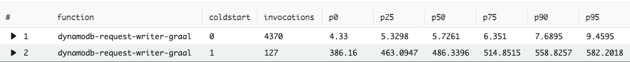

# AWS Lambda GraalVM Native Image with AWS CRT Client

[](https://openjdk.org/projects/jdk/17/)
[](https://www.graalvm.org/)
[](https://docs.aws.amazon.com/sdk-for-java/latest/developer-guide/home.html)
[](https://docs.aws.amazon.com/lambda/latest/dg/lambda-runtimes.html)

A high-performance AWS Lambda function compiled to a **GraalVM native image**, using the **AWS Common Runtime (CRT) HTTP client** for optimized DynamoDB operations. This project demonstrates how to achieve fast cold starts and low-latency execution by combining native ahead-of-time compilation with the AWS CRT -- a high-performance HTTP client written in C.

---

## Overview

This Lambda function:

- Receives **HTTP POST requests** via Amazon API Gateway
- Extracts all request headers from the incoming event
- Writes the headers to an Amazon **DynamoDB** table (`request-headers`) using both sync and async CRT clients
- Runs as a **GraalVM native binary** on the `provided.al2023` custom runtime for minimal cold start latency

## Why AWS CRT Client?

The default HTTP clients in the AWS SDK for Java v2 are [Netty NIO](https://netty.io/) (async) and [Apache HTTP Client](https://hc.apache.org/) (sync). This project replaces both with the **AWS Common Runtime (CRT) HTTP client**.

The CRT client is purpose-built for AWS services and is better suited for GraalVM native image compilation, resulting in **smaller binaries**, **faster startup**, and **lower latency** in production.

## Architecture

```
                                +-----------------+
  Client (curl / Artillery)     |  API Gateway    |
  ──────────────────────────>   |  POST /request- |
                                |  headers-graal  |
                                +--------+--------+
                                         |
                                         v
                                +------------------+
                                |  AWS Lambda       |
                                |  (GraalVM Native) |
                                |  1024 MB / 20s    |
                                |  provided.al2023  |
                                +--------+---------+
                                         |
                           +-------------+-------------+
                           |                           |
                           v                           v
                   +---------------+           +---------------+
                   | DynamoDB Put  |           | DynamoDB Put  |
                   | (Async CRT)  |           | (Sync CRT)    |
                   +-------+-------+           +-------+-------+
                           |                           |
                           +-------------+-------------+
                                         |
                                         v
                                +------------------+
                                |  DynamoDB Table   |
                                |  "request-headers"|
                                +------------------+
```

## Project Structure

```
aws-lambda-graalvm-crt/
|-- Dockerfile                          # Build image: Amazon Linux 2023 + GraalVM CE 17.0.9 + Maven 3.9.6
|-- template.yaml                       # SAM template (Lambda, API Gateway, DynamoDB)
|-- loadtest.yml                        # Artillery load test config (30s, 150 req/s)
|-- result.png                          # Load test results screenshot
|-- README.md
|
`-- request-writer/                     # Lambda function source
    |-- pom.xml                         # Maven build (native + jvm profiles)
    |-- Makefile                        # SAM build integration
    `-- src/main/
        |-- java/com/maschnetwork/
        |   `-- RequestHeaderWriter.java    # Lambda handler
        `-- resources/
            |-- bootstrap                   # Custom runtime bootstrap script
            `-- META-INF/native-image/      # GraalVM native image configuration
                |-- com.maschnetwork/           # App-level reflect + native-image props
                `-- com.amazonaws/
                    |-- crt/aws-crt/            # CRT: reflect, JNI, resource configs
                    |-- aws-lambda-java-core/
                    |-- aws-lambda-java-events/
                    |-- aws-lambda-java-runtime-interface-client/
                    `-- aws-lambda-java-serialization/
```

## Prerequisites

Before you begin, make sure you have the following installed:

- **Docker** -- required to build the GraalVM native image in an Amazon Linux 2023 environment
- **AWS SAM CLI** -- for building, packaging, and deploying the Lambda function
- **AWS CLI** -- configured with valid credentials and a default region
- **An AWS Account** -- with permissions to create Lambda functions, API Gateway, DynamoDB tables, and IAM roles
- **Artillery** *(optional)* -- for running load tests

## Build and Deploy

### 1. Build the Docker Image

The Dockerfile creates a build environment with GraalVM Community Edition 17.0.9, Maven 3.9.6, and the native-image tool on Amazon Linux 2023:

```bash
docker build -t al2023-graalvm:maven .
```

### 2. Build the Application

SAM uses the Docker image to compile the Java source into a GraalVM native binary:

```bash
sam build --build-image al2023-graalvm:maven --use-container
```

This runs `mvn clean install -P native` inside the container, which:
1. Compiles the Java 17 source code
2. Creates an uber-JAR via the Maven Shade plugin
3. Compiles the uber-JAR into a native binary using `native-maven-plugin`
4. Copies the native binary and bootstrap script to the SAM artifacts directory

### 3. Deploy to AWS

For the first deployment (interactive guided setup):

```bash
sam deploy --guided
```

For subsequent deployments:

```bash
sam deploy
```

This creates the following AWS resources:
- **Lambda function** (`dynamodb-request-writer-graal`) with 1024 MB memory and 20s timeout
- **API Gateway** REST API with a `POST /request-headers-graal` endpoint
- **DynamoDB table** (`request-headers`) with on-demand capacity

## Testing

### Get the API Gateway URL

Retrieve the endpoint URL from the CloudFormation stack outputs:

```bash
export API_GW_URL=$(aws cloudformation describe-stacks \
  --stack-name <YOUR-STACK-NAME> \
  | jq -r '.Stacks[0].Outputs[] | select(.OutputKey == "RequestHeaderGraalApi").OutputValue')
```

### Send a Test Request

```bash
curl -XPOST "$API_GW_URL/request-headers-graal" \
  --header 'Content-Type: application/json'
```

A successful response returns:

```
successful
```

Both an async CRT write (id: `<request-id>`) and a sync CRT write (id: `sync-<request-id>`) are persisted to the DynamoDB table.

## Load Testing

### Run the Load Test

The included Artillery configuration sends **150 requests per second** for **30 seconds** (4,500 total requests):

```bash
artillery run -t $API_GW_URL -v '{ "url": "/request-headers-graal" }' loadtest.yml
```

### Analyze Results with CloudWatch Logs Insights

Run the following query in **CloudWatch Logs Insights** to get latency percentiles, grouped by cold start vs. warm start:

```
filter @type = "REPORT"
    | parse @log /\d+:\/aws\/lambda\/(?<function>.*)/
    | stats
    count(*) as invocations,
    pct(@duration+coalesce(@initDuration,0), 0) as p0,
    pct(@duration+coalesce(@initDuration,0), 25) as p25,
    pct(@duration+coalesce(@initDuration,0), 50) as p50,
    pct(@duration+coalesce(@initDuration,0), 75) as p75,
    pct(@duration+coalesce(@initDuration,0), 90) as p90,
    pct(@duration+coalesce(@initDuration,0), 95) as p95,
    pct(@duration+coalesce(@initDuration,0), 99) as p99,
    pct(@duration+coalesce(@initDuration,0), 100) as p100
    group by function, ispresent(@initDuration) as coldstart
    | sort by coldstart, function
```

### Results



**Reading the results:**

| `coldstart` value | Meaning |
|---|---|
| `0` | Warm start -- execution duration only |
| `1` | Cold start -- init duration + execution duration |

## Tech Stack

| Component | Version / Details |
|---|---|
| Java | 17 |
| GraalVM Community Edition | 17.0.9 |
| AWS SDK for Java v2 | 2.23.3 |
| AWS CRT HTTP Client | `AwsCrtHttpClient` (sync) + `AwsCrtAsyncHttpClient` (async) |
| Native Image Plugin | `native-maven-plugin` 0.9.28 |
| Maven Shade Plugin | 3.2.4 |
| Lambda Runtime | `provided.al2023` (Amazon Linux 2023) |
| Build Base Image | `public.ecr.aws/amazonlinux/amazonlinux:2023` |
| Maven | 3.9.6 |
| Infrastructure as Code | AWS SAM |

## Cleanup

To remove all deployed AWS resources:

```bash
sam delete --stack-name <YOUR-STACK-NAME>
```

## License

This project is provided as a sample/demo. See the repository for license details.
