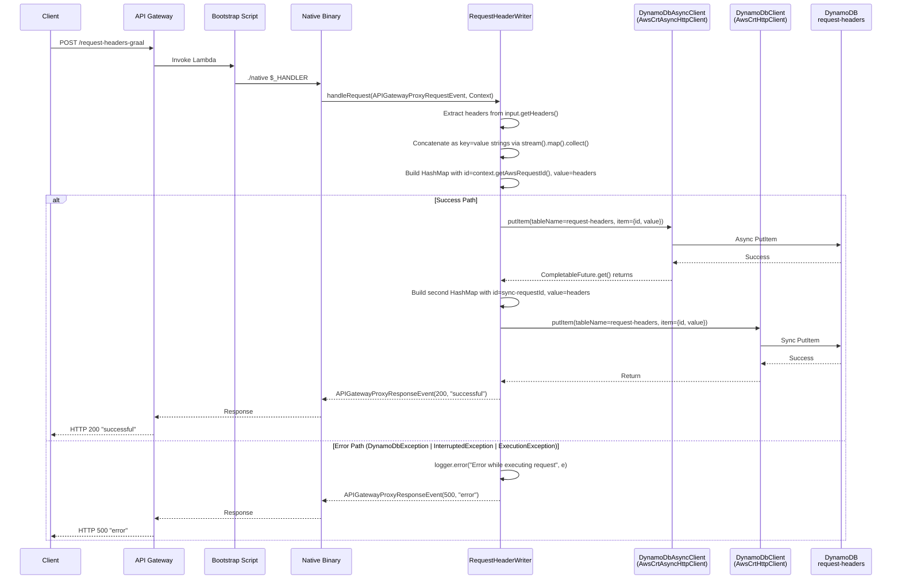
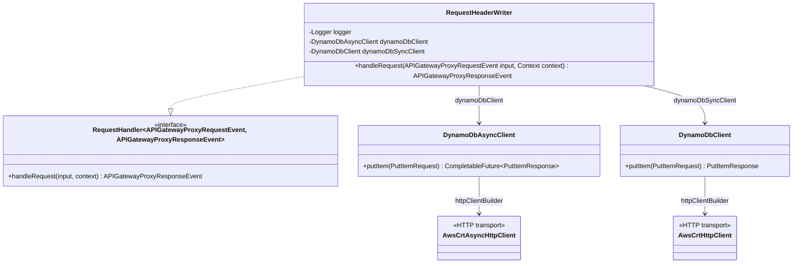
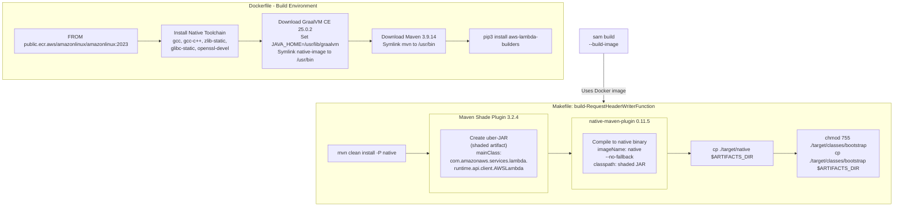
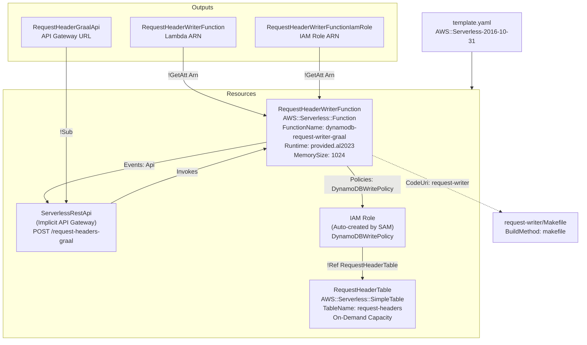
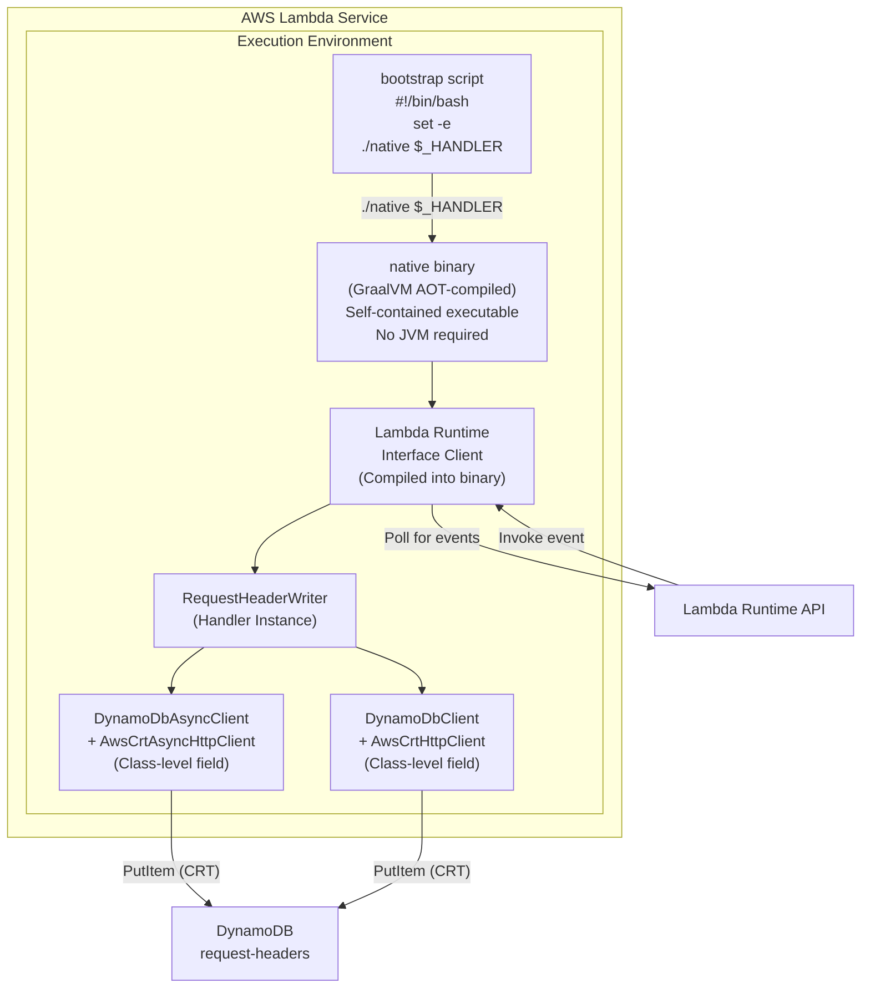
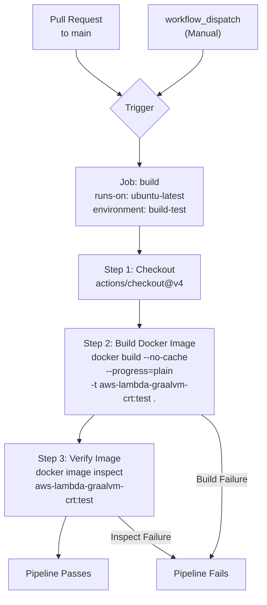

# AWS Lambda GraalVM CRT - Design Document

This document describes the architecture, request flow, component design, build pipeline, and configuration of the **AWS Lambda GraalVM CRT** project - a Java AWS Lambda function compiled to a GraalVM native image that uses the AWS Common Runtime (CRT) HTTP client for DynamoDB operations. The function receives HTTP requests through API Gateway, extracts request headers, and persists them to a DynamoDB table using both asynchronous and synchronous CRT-based SDK clients.

## Table of Contents

1. [System Architecture Overview](#1-system-architecture-overview)
2. [Request Flow](#2-request-flow)
3. [Component Design](#3-component-design)
4. [Build Pipeline](#4-build-pipeline)
5. [GraalVM Native Image Configuration](#5-graalvm-native-image-configuration)
6. [Infrastructure as Code](#6-infrastructure-as-code)
7. [Deployment Architecture](#7-deployment-architecture)
8. [Performance Characteristics](#8-performance-characteristics)
9. [CI/CD Pipeline](#9-cicd-pipeline)
10. [Security Model](#10-security-model)

---

## 1. System Architecture Overview

The system is a serverless application deployed on AWS. Clients send HTTP POST requests to an API Gateway endpoint, which invokes a Lambda function compiled as a GraalVM native image. The Lambda function extracts request headers and writes them to a DynamoDB table twice - once via the async CRT HTTP client and once via the sync CRT HTTP client.

Key configuration from `template.yaml`:

| Property | Value |
|---|---|
| Runtime | `provided.al2023` |
| Memory | 1024 MB |
| Timeout | 20 seconds |
| Handler | `com.maschnetwork.RequestHeaderWriter` |
| Function Name | `dynamodb-request-writer-graal` |
| API Path | `POST /request-headers-graal` |

```mermaid
flowchart LR
    Client["Client\n(curl / Artillery)"]
    APIGW["API Gateway\nPOST /request-headers-graal"]
    Lambda["Lambda Function\nGraalVM Native Image\n1024 MB / 20s timeout\nprovided.al2023\nHandler: com.maschnetwork.RequestHeaderWriter"]
    AsyncWrite["Async CRT Write\nDynamoDbAsyncClient\n+ AwsCrtAsyncHttpClient"]
    SyncWrite["Sync CRT Write\nDynamoDbClient\n+ AwsCrtHttpClient"]
    DDB["DynamoDB Table\nrequest-headers"]

    Client -->|HTTP POST| APIGW
    APIGW -->|Invoke| Lambda
    Lambda -->|PutItem .get\(\)| AsyncWrite
    Lambda -->|PutItem| SyncWrite
    AsyncWrite -->|Write| DDB
    SyncWrite -->|Write| DDB
```

The architecture uses the `provided.al2023` custom runtime, meaning the Lambda execution environment runs a native binary directly rather than a JVM. The bootstrap shell script at `request-writer/src/main/resources/bootstrap` starts the native binary:

```bash
#!/bin/bash
set -e
./native $_HANDLER
```

---

## 2. Request Flow

The following sequence diagram shows the full request lifecycle, including both the success path (HTTP 200) and the error path (HTTP 500).



Key details of the request flow:

1. The async write uses `DynamoDbAsyncClient.putItem()` which returns a `CompletableFuture`. The handler calls `.get()` to block until the write completes.
2. The sync write uses `DynamoDbClient.putItem()` which blocks natively.
3. The async write uses the request ID directly as the `id` attribute, while the sync write prepends `"sync-"` to the request ID.
4. Both writes store identical header data in the `value` attribute.
5. The error handler catches three exception types: `DynamoDbException`, `InterruptedException`, and `ExecutionException`.

---

## 3. Component Design

### RequestHeaderWriter Class

The handler class is located at `request-writer/src/main/java/com/maschnetwork/RequestHeaderWriter.java`. It implements the AWS Lambda `RequestHandler` interface.



### Class-Level Fields

All three fields are initialized at class construction time and reused across Lambda invocations (taking advantage of Lambda execution environment reuse):

| Field | Type | Configuration |
|---|---|---|
| `logger` | `Logger` (SLF4J) | `LoggerFactory.getLogger(RequestHeaderWriter.class)` |
| `dynamoDbClient` | `DynamoDbAsyncClient` | `EnvironmentVariableCredentialsProvider`, `Region.of(System.getenv(AWS_REGION))`, `AwsCrtAsyncHttpClient.builder()` |
| `dynamoDbSyncClient` | `DynamoDbClient` | `EnvironmentVariableCredentialsProvider`, `Region.of(System.getenv(AWS_REGION))`, `AwsCrtHttpClient.builder()` |

Both DynamoDB clients are configured identically except for the HTTP client transport layer:

- The async client uses `AwsCrtAsyncHttpClient.builder()` (non-blocking CRT HTTP client)
- The sync client uses `AwsCrtHttpClient.builder()` (blocking CRT HTTP client)

Both clients exclude the default Netty and Apache HTTP clients via Maven dependency exclusions in `request-writer/pom.xml`:

```xml
<exclusions>
    <exclusion>
        <groupId>software.amazon.awssdk</groupId>
        <artifactId>netty-nio-client</artifactId>
    </exclusion>
    <exclusion>
        <groupId>software.amazon.awssdk</groupId>
        <artifactId>apache-client</artifactId>
    </exclusion>
</exclusions>
```

### handleRequest Method Logic

1. Create a `HashMap<String, AttributeValue>` with:
   - `"id"` set to `context.getAwsRequestId()`
   - `"value"` set to all request headers concatenated as `key=value` strings using `stream().map(a -> a.getKey()+"="+a.getValue()).collect(Collectors.joining())`
2. Call `dynamoDbClient.putItem()` targeting the `"request-headers"` table, then `.get()` to block on the `CompletableFuture`
3. Create a second `HashMap<String, AttributeValue>` with:
   - `"id"` set to `"sync-" + context.getAwsRequestId()`
   - `"value"` set to the same concatenated headers
4. Call `dynamoDbSyncClient.putItem()` targeting the `"request-headers"` table (blocking call)
5. Return `APIGatewayProxyResponseEvent` with status code `200` and body `"successful"`
6. On exception (`DynamoDbException`, `InterruptedException`, or `ExecutionException`): log the error and return status code `500` with body `"error"`

---

## 4. Build Pipeline

The build process uses a custom Docker image to provide the GraalVM native compilation toolchain. SAM CLI orchestrates the build by invoking a Makefile target inside the Docker container.

### Build Flow



### Dockerfile Details

The `Dockerfile` at the project root builds the compilation environment:

- **Base image**: `public.ecr.aws/amazonlinux/amazonlinux:2023`
- **Native toolchain packages**: `gcc`, `gcc-c++`, `gcc-gfortran`, `zlib-devel`, `zlib-static`, `glibc-static`, `openssl`, `openssl-devel`, `libcurl-devel`, `readline-devel`, `xz-devel`, `bzip2-devel`, `ed`, `unzip`, `tar`, `gzip`, `less`
- **GraalVM CE**: Version `25.0.2`, installed to `/usr/lib/graalvm`, with `native-image` symlinked to `/usr/bin/native-image`
- **Maven**: Version `3.9.14`, installed to `/usr/lib/maven`, with `mvn` symlinked to `/usr/bin/mvn`
- **aws-lambda-builders**: Installed via `pip3` for SAM integration
- **JAVA_HOME**: Set to `/usr/lib/graalvm`

### Maven Native Profile

The `native` profile in `request-writer/pom.xml` chains two plugins during the `package` phase:

1. **Maven Shade Plugin 3.2.4**: Creates an uber-JAR containing all dependencies. The `ManifestResourceTransformer` sets the main class to `com.amazonaws.services.lambda.runtime.api.client.AWSLambda` (the Lambda Runtime Interface Client entry point). The shaded artifact is attached with classifier `shaded`.

2. **native-maven-plugin 0.11.5** (org.graalvm.buildtools): Compiles the shaded JAR into a native binary named `native` using `--no-fallback` (no JVM fallback allowed). The classpath points to `${project.build.directory}/${project.artifactId}-${project.version}-shaded.jar`.

### Maven JVM Profile

The `jvm` profile provides a simpler build path that only runs the Maven Shade Plugin 3.2.4 (without the `ManifestResourceTransformer`). No native compilation occurs. This profile is useful for testing the application on a standard JVM without the overhead of native image compilation.

### Makefile

The `request-writer/Makefile` defines the `build-RequestHeaderWriterFunction` target referenced by `template.yaml` (`BuildMethod: makefile`):

```makefile
build-RequestHeaderWriterFunction:
	mvn clean install -P native
	cp ./target/native $(ARTIFACTS_DIR)
	chmod 755 ./target/classes/bootstrap
	cp ./target/classes/bootstrap $(ARTIFACTS_DIR)
```

The target copies two artifacts to `$ARTIFACTS_DIR`:
- `target/native` - the GraalVM native binary
- `target/classes/bootstrap` - the shell script that starts the native binary (made executable with `chmod 755`)

### Dependency Versions

| Dependency | Version |
|---|---|
| AWS SDK for Java v2 (BOM) | 2.23.3 |
| aws-lambda-java-core | 1.2.3 |
| aws-lambda-java-events | 3.11.4 |
| aws-lambda-java-runtime-interface-client | 2.4.1 |
| slf4j-simple | 1.7.36 |
| Maven Shade Plugin | 3.2.4 |
| native-maven-plugin | 0.11.5 |
| Java source/target | 25 |

---

## 5. GraalVM Native Image Configuration

GraalVM native image compilation requires explicit configuration for reflection, JNI, and resource loading since these cannot be determined through static analysis. The project organizes configuration files under `request-writer/src/main/resources/META-INF/native-image/`, grouped by library.

### Configuration Directory Structure

```mermaid
flowchart TD
    Root["META-INF/native-image/"]

    MN["com.maschnetwork/"]
    MN_NI["native-image.properties"]
    MN_RC["reflect-config.json"]

    CRT["com.amazonaws/crt/aws-crt/"]
    CRT_NI["native-image.properties"]
    CRT_RC["reflect-config.json"]
    CRT_JNI["jni-config.json (474 lines)"]
    CRT_RES["resource-config.json"]

    RIC["com.amazonaws/aws-lambda-java-runtime-interface-client/"]
    RIC_NI["native-image.properties"]
    RIC_RC["reflect-config.json"]
    RIC_JNI["jni-config.json"]
    RIC_RES["resource-config.json"]

    EVT["com.amazonaws/aws-lambda-java-events/"]
    EVT_RC["reflect-config.json"]

    CORE["com.amazonaws/aws-lambda-java-core/"]
    CORE_RC["reflect-config.json"]

    SER["com.amazonaws/aws-lambda-java-serialization/"]
    SER_RC["reflect-config.json"]

    Root --> MN
    MN --> MN_NI
    MN --> MN_RC

    Root --> CRT
    CRT --> CRT_NI
    CRT --> CRT_RC
    CRT --> CRT_JNI
    CRT --> CRT_RES

    Root --> RIC
    RIC --> RIC_NI
    RIC --> RIC_RC
    RIC --> RIC_JNI
    RIC --> RIC_RES

    Root --> EVT
    EVT --> EVT_RC

    Root --> CORE
    CORE --> CORE_RC

    Root --> SER
    SER --> SER_RC
```



### (a) com.maschnetwork

Path: `META-INF/native-image/com.maschnetwork/`

**native-image.properties**

```
Args = --enable-url-protocols=http,https
```

Enables HTTP and HTTPS URL protocol support in the native image, required for the CRT HTTP clients to make network calls.

**reflect-config.json**

Registers the handler class for full reflective access:

```json
[
  {
    "name": "com.maschnetwork.RequestHeaderWriter",
    "allDeclaredConstructors": true,
    "allPublicConstructors": true,
    "allDeclaredMethods": true,
    "allPublicMethods": true,
    "allDeclaredClasses": true,
    "allPublicClasses": true
  }
]
```

The Lambda Runtime Interface Client needs reflective access to instantiate the handler class and invoke `handleRequest`.

### (b) com.amazonaws/crt/aws-crt

Path: `META-INF/native-image/com.amazonaws/crt/aws-crt/`

This is the largest configuration set, covering the AWS Common Runtime JNI bindings.

**native-image.properties**

```
Args=--initialize-at-run-time=io.netty.util.internal.logging.Log4JLogger -H:ClassInitialization=org.slf4j:build_time
```

- `--initialize-at-run-time=io.netty.util.internal.logging.Log4JLogger`: Defers Netty's Log4J logger initialization to runtime (avoids build-time initialization issues when Log4J is not on the classpath).
- `-H:ClassInitialization=org.slf4j:build_time`: Initializes all SLF4J classes at build time for faster startup.

**reflect-config.json** (61 lines)

Registers core Java and CRT classes for reflection:

- **Java core**: `java.lang.Object` (all declared fields and methods), `java.lang.Throwable` (`getSuppressed`), `java.util.concurrent.ForkJoinTask` (`aux`, `status` fields), `java.util.concurrent.atomic.AtomicBoolean` and `AtomicReference` (`value` field)
- **Test framework** (included from tracing agent): `org.hamcrest.core.Every`, `org.junit.internal.AssumptionViolatedException`, `org.junit.platform.launcher.LauncherSession`, `org.junit.platform.launcher.core.LauncherFactory`, `org.junit.runner.Description`
- **CRT core**: `software.amazon.awssdk.crt.CRT`, `software.amazon.awssdk.crt.CrtResource`
- **Security providers**: `sun.security.provider.NativePRNG`, `sun.security.provider.SHA`, `sun.security.provider.SHA2$SHA256` (all with default constructor access)

**jni-config.json** (474 lines)

The largest configuration file, registering classes for JNI access from the native CRT library (`libaws-crt-jni.so`). The JNI config covers the following categories:

- **Java primitives and utilities**: `Boolean`, `Integer`, `Long`, `String`, `System`, `NullPointerException`, `ByteBuffer`, `Buffer`, `ArrayList`, `List`, `CompletableFuture`, `Predicate`
- **CRT core**: `AsyncCallback`, `CRT`, `CrtResource`, `CrtRuntimeException`, `SystemInfo$CpuInfo`
- **HTTP**: `HttpClientConnection`, `HttpClientConnectionManager`, `HttpHeader`, `HttpManagerMetrics`, `HttpProxyOptions`, `HttpRequest`, `HttpRequestBase`, `HttpRequestBodyStream`, `HttpStream`, `Http2Stream`, `Http2StreamManager`, `HttpStreamMetrics`, `HttpStreamResponseHandlerNativeAdapter`
- **IO**: `ClientBootstrap`, `DirectoryEntry`, `DirectoryTraversalHandler`, `EventLoopGroup`, `ExponentialBackoffRetryOptions`, `StandardRetryOptions`, `TlsContextCustomKeyOperationOptions`, `TlsContextPkcs11Options`, `TlsKeyOperation`, `TlsKeyOperationHandler`
- **Auth**: `Credentials`, `CredentialsProvider`, `DelegateCredentialsHandler`, `AwsSigningConfig`, `AwsSigningResult`, `EccKeyPair`
- **Event stream**: `ClientConnectionContinuationHandler`, `ClientConnectionHandler`, `MessageFlushCallback`, `ServerConnection`, `ServerConnectionContinuation`, `ServerConnectionContinuationHandler`, `ServerConnectionHandler`, `ServerListener`, `ServerListenerHandler`
- **MQTT**: `MqttClientConnection`, `MqttClientConnection$MessageHandler`, `MqttClientConnectionOperationStatistics`, `MqttException`
- **MQTT5**: `Mqtt5Client`, `Mqtt5ClientOperationStatistics`, `Mqtt5ClientOptions` (and its nested types: `ClientOfflineQueueBehavior`, `ClientSessionBehavior`, `ExtendedValidationAndFlowControlOptions`, `LifecycleEvents`, `PublishEvents`), `NegotiatedSettings`, `QOS`, `TopicAliasingOptions`, various packet types (`ConnAckPacket`, `ConnectPacket`, `DisconnectPacket`, `PubAckPacket`, `PublishPacket`, `SubAckPacket`, `SubscribePacket`, `UnsubAckPacket`, `UnsubscribePacket`, `UserProperty`)
- **S3**: `ResumeToken`, `S3Client`, `S3ExpressCredentialsProperties`, `S3ExpressCredentialsProvider`, `S3ExpressCredentialsProviderFactory`, `S3MetaRequest`, `S3MetaRequestProgress`, `S3MetaRequestResponseHandlerNativeAdapter`, `S3TcpKeepAliveOptions`
- **JVM internals**: `sun.management.VMManagementImpl`

Although this project only uses DynamoDB, the CRT JNI config must include the full CRT surface area because the native library is compiled as a single shared object that references all these classes.

**resource-config.json**

Includes the platform-specific CRT native library:

```json
{
  "resources": {
    "includes": [
      {"pattern": ".*libaws-crt-jni.dylib"},
      {"pattern": ".*libaws-crt-jni.so"},
      {"pattern": ".*libaws-crt-jni.dll"}
    ]
  },
  "bundles": []
}
```

All three platform variants (macOS `.dylib`, Linux `.so`, Windows `.dll`) are included to support cross-platform builds, though only the `.so` variant is used at runtime on Amazon Linux 2023.

### (c) com.amazonaws/aws-lambda-java-runtime-interface-client

Path: `META-INF/native-image/com.amazonaws/aws-lambda-java-runtime-interface-client/`

**native-image.properties**

```
Args = --initialize-at-build-time=jdk.xml.internal.SecuritySupport
```

Initializes the JDK XML security support class at build time for faster startup.

**reflect-config.json** (43 lines)

Registers Lambda runtime internals for reflective access:

- **Jackson deserialization**: `com.amazonaws.lambda.thirdparty.com.fasterxml.jackson.databind.deser.Deserializers[]`, `Java7SupportImpl`
- **Lambda Runtime**: `com.amazonaws.services.lambda.runtime.LambdaRuntime` (constructor, `logger` field, all public methods)
- **AWSLambda entry point**: `com.amazonaws.services.lambda.runtime.api.client.AWSLambda` (all declared fields, classes, methods, constructors)
- **InvocationRequest**: All fields (`id`, `invokedFunctionArn`, `deadlineTimeInMs`, `xrayTraceId`, `clientContext`, `cognitoIdentity`, `content`) and all public methods
- **Java utilities**: `java.lang.Void`, `java.util.Collections$UnmodifiableMap` (`m` field)
- **JDK internals**: `jdk.internal.module.IllegalAccessLogger` (`logger` field), `sun.misc.Unsafe` (`theUnsafe` field)

**jni-config.json** (11 lines)

Registers two classes for JNI access from the native Lambda runtime client library:

- `LambdaRuntimeClientException`: Constructor taking `(String, int)`
- `InvocationRequest`: All fields and public methods (mirrors the reflect-config entry)

**resource-config.json**

Includes the Lambda runtime native library:

```json
{
  "resources": {
    "includes": [
      {"pattern": ".*libaws-lambda-jni.*.so"}
    ]
  },
  "bundles": []
}
```

### (d) com.amazonaws/aws-lambda-java-events

Path: `META-INF/native-image/com.amazonaws/aws-lambda-java-events/`

**reflect-config.json** (66 lines)

Registers the API Gateway event model classes for Jackson deserialization. The Lambda runtime deserializes the incoming API Gateway event JSON into these types:

- `APIGatewayProxyRequestEvent` (all declared fields, methods, constructors)
- `APIGatewayProxyRequestEvent$ProxyRequestContext`
- `APIGatewayProxyRequestEvent$RequestIdentity`
- `APIGatewayProxyRequestEvent$RequestContext`
- `APIGatewayProxyRequestEvent$RequestContext$Authorizer`
- `APIGatewayProxyRequestEvent$RequestContext$Authorizer$JWT`
- `APIGatewayProxyRequestEvent$RequestContext$CognitoIdentity`
- `APIGatewayProxyRequestEvent$RequestContext$Http`
- `APIGatewayProxyResponseEvent` (registered twice - once with declared-only access, once with full public access including classes)

All inner classes of `APIGatewayProxyRequestEvent` must be registered because Jackson may encounter these nested objects when deserializing the full API Gateway event payload.

### (e) com.amazonaws/aws-lambda-java-core

Path: `META-INF/native-image/com.amazonaws/aws-lambda-java-core/`

**reflect-config.json** (23 lines)

Registers core Lambda runtime types:

- `LambdaRuntime`: Constructor, `logger` field, all public methods
- `LambdaRuntimeInternal`: Constructor, all public methods
- `LogLevel`: Full access (all constructors, fields, methods, classes) - this is an enum used by the Lambda logging subsystem

### (f) com.amazonaws/aws-lambda-java-serialization

Path: `META-INF/native-image/com.amazonaws/aws-lambda-java-serialization/`

**reflect-config.json** (26 lines)

Registers Jackson serialization framework classes used by the Lambda runtime for event (de)serialization:

- `Deserializers[]`: Jackson deserializer array type (shaded under `com.amazonaws.lambda.thirdparty`)
- `Java7HandlersImpl`: Jackson Java 7 handler implementation (default constructor)
- `Java7SupportImpl`: Jackson Java 7 support implementation (default constructor)
- `Serializers[]`: Jackson serializer array type (shaded under `com.amazonaws.lambda.thirdparty`)
- `org.joda.time.DateTime`: Full access (all constructors, methods, classes) - required for Jackson's Joda date/time module support

---

## 6. Infrastructure as Code

The entire application infrastructure is defined in `template.yaml` using the AWS Serverless Application Model (SAM). SAM extends CloudFormation with simplified syntax for serverless resources, and the template declares all resources needed to deploy the Lambda function, API Gateway, and DynamoDB table.

### SAM Template Structure

The template uses `AWS::Serverless-2016-10-31` transform and defines the following:

**Global Settings:**

```yaml
Globals:
  Function:
    Timeout: 20
```

The global `Timeout: 20` (seconds) applies to all `AWS::Serverless::Function` resources in the template.

### AWS::Serverless::Function - RequestHeaderWriterFunction

The Lambda function resource is the core of the application:

| Property | Value | Description |
|---|---|---|
| FunctionName | `dynamodb-request-writer-graal` | Explicit function name in AWS |
| CodeUri | `request-writer` | Path to the function source directory |
| Runtime | `provided.al2023` | Custom runtime on Amazon Linux 2023 |
| MemorySize | `1024` | 1024 MB of memory allocated |
| Handler | `com.maschnetwork.RequestHeaderWriter` | Fully qualified handler class name |
| Timeout | `20` | Inherited from Globals section |

**Build Configuration:**

```yaml
Metadata:
  BuildMethod: makefile
```

The `BuildMethod: makefile` tells SAM to invoke the `Makefile` in the `request-writer/` directory during `sam build`, rather than using a built-in build strategy. This Makefile orchestrates the Maven native profile build and copies the native binary plus bootstrap script to the SAM artifacts directory.

**Events - API Gateway Integration:**

```yaml
Events:
  RequestHeaderEvent:
    Type: Api
    Properties:
      Path: /request-headers-graal
      Method: post
```

SAM automatically creates an `AWS::Serverless::Api` (implicit `ServerlessRestApi`) resource and configures a `POST /request-headers-graal` route that invokes the Lambda function.

**IAM Policies:**

```yaml
Policies:
  - DynamoDBWritePolicy:
      TableName: !Ref RequestHeaderTable
```

The `DynamoDBWritePolicy` is a SAM policy template that grants write-only access to the specified DynamoDB table. The `!Ref RequestHeaderTable` resolves to the table name (`request-headers`), scoping permissions to that specific table.

### AWS::Serverless::SimpleTable - RequestHeaderTable

```yaml
RequestHeaderTable:
  Type: AWS::Serverless::SimpleTable
  Properties:
    TableName: request-headers
```

`AWS::Serverless::SimpleTable` creates a DynamoDB table with a single primary key attribute (`id` of type `String` by default) and on-demand capacity mode. This is a simplified alternative to `AWS::DynamoDB::Table` suitable for simple key-value use cases.

### Outputs

The template exports three outputs for use by other stacks or for retrieving deployment information:

| Output | Value | Description |
|---|---|---|
| `RequestHeaderGraalApi` | `!Sub "https://${ServerlessRestApi}.execute-api.${AWS::Region}.amazonaws.com/Prod/"` | API Gateway endpoint URL for the Prod stage |
| `RequestHeaderWriterFunction` | `!GetAtt RequestHeaderWriterFunction.Arn` | Lambda function ARN |
| `RequestHeaderWriterFunctionIamRole` | `!GetAtt RequestHeaderWriterFunction.Arn` | IAM role ARN (resolves via the function resource) |

### CloudFormation Resource Relationships



---

## 7. Deployment Architecture

This section describes how the application runs inside the AWS Lambda execution environment when deployed.

### Lambda Custom Runtime

The function uses the `provided.al2023` custom runtime, which means AWS Lambda does not supply a language-specific runtime (like the Java runtime). Instead, Lambda expects a `bootstrap` executable in the deployment package that starts the function process.

The bootstrap script at `request-writer/src/main/resources/bootstrap`:

```bash
#!/bin/bash
set -e
./native $_HANDLER
```

- `set -e` ensures the script exits immediately on any error
- `./native` is the GraalVM native binary (compiled from the uber-JAR)
- `$_HANDLER` is set by Lambda to the configured handler value (`com.maschnetwork.RequestHeaderWriter`)

The native binary is a fully self-contained executable. No JVM is required at runtime - all necessary code, including the Java standard library subset, is compiled ahead-of-time into the binary by GraalVM.

### Cold Start vs. Warm Start

**Cold Start Flow:**

1. Lambda receives a request with no available execution environment
2. Lambda downloads and extracts the deployment package (native binary + bootstrap)
3. Lambda runs the `bootstrap` script, which starts the `native` binary
4. The native binary initializes the Lambda runtime interface client
5. Class-level fields are initialized, creating `DynamoDbAsyncClient` and `DynamoDbClient` with CRT HTTP clients
6. The function processes the first request

GraalVM native images avoid JVM class loading, bytecode interpretation, and JIT compilation during startup. The binary starts executing application code immediately, resulting in significantly faster cold starts compared to a traditional JVM-based Lambda.

**Warm Start Flow:**

1. Lambda reuses an existing execution environment from a previous invocation
2. The `native` binary process is already running
3. The class-level `DynamoDbAsyncClient` (`dynamoDbClient`) and `DynamoDbClient` (`dynamoDbSyncClient`) persist across invocations
4. CRT HTTP connections and resources established during previous invocations may be reused
5. The function handles the request without any initialization overhead

The key optimization is that both DynamoDB clients are declared as class-level (instance) fields in `RequestHeaderWriter.java`:

```java
private final DynamoDbAsyncClient dynamoDbClient = DynamoDbAsyncClient.builder()
        .credentialsProvider(EnvironmentVariableCredentialsProvider.create())
        .region(Region.of(System.getenv(SdkSystemSetting.AWS_REGION.environmentVariable())))
        .httpClientBuilder(AwsCrtAsyncHttpClient.builder())
        .build();

private final DynamoDbClient dynamoDbSyncClient = DynamoDbClient.builder()
        .credentialsProvider(EnvironmentVariableCredentialsProvider.create())
        .region(Region.of(System.getenv(SdkSystemSetting.AWS_REGION.environmentVariable())))
        .httpClientBuilder(AwsCrtHttpClient.builder())
        .build();
```

These fields are initialized once when the handler class is instantiated and reused for all subsequent invocations within the same execution environment.

### Runtime Configuration

| Setting | Value |
|---|---|
| Runtime | `provided.al2023` (Amazon Linux 2023) |
| Memory | 1024 MB |
| Timeout | 20 seconds |
| Architecture | x86_64 (default) |
| Binary Name | `native` (output of `native-maven-plugin`, imageName config) |

### Lambda Execution Environment



---

## 8. Performance Characteristics

### Load Testing Setup

The project includes an Artillery load test configuration in `loadtest.yml`:

```yaml
config:
  phases:
    - duration: 30
      arrivalRate: 150
scenarios:
  - flow:
      - post:
          url: "{{ url }}"
```

This configuration sends **150 requests per second** for **30 seconds**, producing **4,500 total requests**. All requests are HTTP POST.

**Running the load test:**

```bash
artillery run -t $API_GW_URL -v '{ "url": "/request-headers-graal" }' loadtest.yml
```

Where `$API_GW_URL` is the API Gateway endpoint URL from the CloudFormation stack outputs.

### Why GraalVM Native + CRT Improves Performance

The combination of GraalVM native image compilation and the AWS CRT HTTP client addresses multiple performance bottlenecks in traditional Java Lambda functions:

**1. AOT Compilation Eliminates JVM Startup Time**

Standard Java Lambda functions must start the JVM, load classes from the classpath, interpret bytecode, and eventually JIT-compile hot paths. GraalVM ahead-of-time (AOT) compilation eliminates all of these steps:

- No class loading at runtime - all classes are resolved at build time
- No bytecode interpretation - machine code is generated during the build
- No JIT compilation warmup - all code paths execute at full speed from the first invocation
- Reduced memory footprint - no JVM metadata structures (class loaders, JIT compiler state)

**2. AWS CRT HTTP Client**

The AWS CRT HTTP client is a purpose-built HTTP client written in C, designed specifically for AWS service communication:

- Lower overhead than the default Netty NIO (async) and Apache HTTP Client (sync) that ship with the AWS SDK for Java v2
- The `pom.xml` explicitly excludes both default clients and replaces them with `aws-crt-client`
- CRT handles TLS, connection pooling, and HTTP/2 at the native level
- Better suited for GraalVM native image compilation than Netty (which relies heavily on reflection and runtime code generation)

**3. Smaller Binary and Lower Memory**

- The native binary contains only reachable code (dead code is eliminated at build time)
- No JVM distribution is packaged in the deployment artifact
- Lower memory footprint allows the same 1024 MB allocation to serve the application more efficiently

**4. Deterministic Performance**

- No JIT warmup means the first invocation performs similarly to subsequent invocations
- Response times are more predictable across cold and warm starts
- Performance does not degrade under varying load patterns that would cause JIT deoptimization

### Analyzing Results with CloudWatch Logs Insights

After running the load test, use the following CloudWatch Logs Insights query to analyze latency percentiles, grouped by cold start versus warm start:

```
filter @type = "REPORT"
    | parse @log /\d+:\/aws\/lambda\/(?<function>.*)/
    | stats
    count(*) as invocations,
    pct(@duration+coalesce(@initDuration,0), 0) as p0,
    pct(@duration+coalesce(@initDuration,0), 25) as p25,
    pct(@duration+coalesce(@initDuration,0), 50) as p50,
    pct(@duration+coalesce(@initDuration,0), 75) as p75,
    pct(@duration+coalesce(@initDuration,0), 90) as p90,
    pct(@duration+coalesce(@initDuration,0), 95) as p95,
    pct(@duration+coalesce(@initDuration,0), 99) as p99,
    pct(@duration+coalesce(@initDuration,0), 100) as p100
    group by function, ispresent(@initDuration) as coldstart
    | sort by coldstart, function
```

**Understanding the Results:**

| `coldstart` Value | Meaning |
|---|---|
| `0` | Warm start - duration reflects execution time only |
| `1` | Cold start - duration includes both init time (`@initDuration`) and execution time (`@duration`) |

- `coalesce(@initDuration, 0)` ensures warm invocations (where `@initDuration` is absent) contribute only their execution duration
- Percentiles (p0 through p100) show the distribution of total response times
- Comparing cold start vs. warm start rows reveals the init overhead added by GraalVM native startup

### Load Test Results

See `result.png` in the project root for a screenshot of the load test results.

---

## 9. CI/CD Pipeline

### GitHub Actions Workflow

The project includes a CI pipeline defined in `.github/workflows/docker-build-test.yml` that validates the Docker build image can be built successfully.

**Workflow: Docker Image Build Test**

```yaml
name: Docker Image Build Test

on:
  pull_request:
    branches:
      - main
  workflow_dispatch:
```

**Triggers:**

| Trigger | Description |
|---|---|
| `pull_request` to `main` | Runs automatically on every pull request targeting the `main` branch |
| `workflow_dispatch` | Allows manual triggering from the GitHub Actions UI |

**Job Configuration:**

| Setting | Value |
|---|---|
| Job Name | `build` (display: "Build Docker Image") |
| Runner | `ubuntu-latest` |
| Environment | `build-test` |

### Pipeline Steps

**Step 1: Checkout Repository**

```yaml
- name: Checkout repository
  uses: actions/checkout@v4
```

Clones the repository using the standard GitHub checkout action (v4).

**Step 2: Build Docker Image**

```yaml
- name: Build Docker image
  run: docker build --no-cache --progress=plain -t aws-lambda-graalvm-crt:test .
```

Builds the Docker image from the root `Dockerfile`. The flags ensure:
- `--no-cache`: Every layer is built from scratch (no cached layers from previous runs)
- `--progress=plain`: Full build output is displayed in the CI logs (not the default TTY-style progress)
- `-t aws-lambda-graalvm-crt:test`: Tags the image for the verification step

This step validates that the entire build environment (Amazon Linux 2023, GraalVM CE 25.0.2, Maven 3.9.14, native-image, aws-lambda-builders) can be assembled successfully.

**Step 3: Verify Image**

```yaml
- name: Verify image was created
  run: docker image inspect aws-lambda-graalvm-crt:test
```

Confirms the Docker image was created and is valid by inspecting its metadata. This step fails if the build step produced a broken or missing image.

### CI Pipeline Flow



### What the Pipeline Does Not Cover

The CI pipeline validates only the Docker build image, not the full application build. It does not:

- Run `sam build` (requires SAM CLI and AWS credentials)
- Compile the native image (requires running Maven inside the Docker container)
- Execute integration tests or load tests
- Deploy to AWS

The pipeline serves as a smoke test to ensure the build environment (GraalVM, Maven, native-image tool, system dependencies) remains functional as dependencies are updated.

---

## 10. Security Model

### Credential Management

The Lambda function uses `EnvironmentVariableCredentialsProvider` to obtain AWS credentials:

```java
.credentialsProvider(EnvironmentVariableCredentialsProvider.create())
```

This provider reads the following environment variables, which are automatically injected by the Lambda service from the function's execution role:

| Environment Variable | Purpose |
|---|---|
| `AWS_ACCESS_KEY_ID` | IAM access key identifier |
| `AWS_SECRET_ACCESS_KEY` | IAM secret access key |
| `AWS_SESSION_TOKEN` | Temporary session token (STS) |

No credentials are hardcoded in the source code. The credentials are temporary (session-based) and rotated automatically by the Lambda service.

### IAM - Least-Privilege Access

The function's permissions are defined using the SAM `DynamoDBWritePolicy` policy template:

```yaml
Policies:
  - DynamoDBWritePolicy:
      TableName: !Ref RequestHeaderTable
```

This policy template grants only DynamoDB write operations (`dynamodb:PutItem`, `dynamodb:UpdateItem`, `dynamodb:BatchWriteItem`) on the specific table referenced by `!Ref RequestHeaderTable` (which resolves to `request-headers`). The function cannot:

- Read items from the table
- Delete items from the table
- Perform operations on any other DynamoDB table
- Access any other AWS service

The IAM role itself is auto-created by SAM. When you specify `Policies` on an `AWS::Serverless::Function`, SAM generates an implicit IAM execution role with the specified policies attached. This role is referenced in the template outputs as `RequestHeaderWriterFunctionIamRole`.

### API Gateway Security

The API Gateway endpoint (`POST /request-headers-graal`) is publicly accessible:

- No API key requirement is configured
- No IAM authorization is enabled on the API method
- No Amazon Cognito authorizer is attached
- No Lambda authorizer is configured

Any client that can reach the API Gateway URL can invoke the Lambda function. In a production deployment, you would typically add one or more of these authorization mechanisms.

### Network Security

The Lambda function runs in an AWS-managed VPC by default. No custom VPC configuration is specified in `template.yaml`, which means:

- Lambda manages the network environment
- The function can access AWS services (DynamoDB) via the AWS network
- The function is not placed in a customer-managed VPC with specific security groups or subnets
- No VPC endpoints are needed since the function uses the default Lambda networking

### Native Binary Security

The GraalVM native image is compiled with the `--no-fallback` flag (configured in `pom.xml` under the `native-maven-plugin`):

```xml
<buildArgs>
    <buildArg>--no-fallback</buildArg>
</buildArgs>
```

This flag ensures:

- The binary is fully self-contained with no JVM fallback mode
- If a class or method cannot be compiled ahead-of-time, the build fails rather than silently falling back to a JVM
- The deployed artifact has a smaller attack surface - there is no JVM runtime that could be exploited
- All code paths are statically analyzed and compiled, eliminating risks from dynamic class loading at runtime

### Security Summary

| Aspect | Implementation |
|---|---|
| Credentials | `EnvironmentVariableCredentialsProvider` - reads from Lambda-injected environment variables |
| IAM Policy | `DynamoDBWritePolicy` - write-only access scoped to `request-headers` table |
| API Authentication | None configured (public endpoint) |
| Hardcoded Secrets | None - no credentials in source code |
| IAM Role | Auto-created by SAM from the `Policies` section |
| Network | AWS-managed VPC (default Lambda networking) |
| Binary | `--no-fallback` ensures fully AOT-compiled, no JVM fallback |
